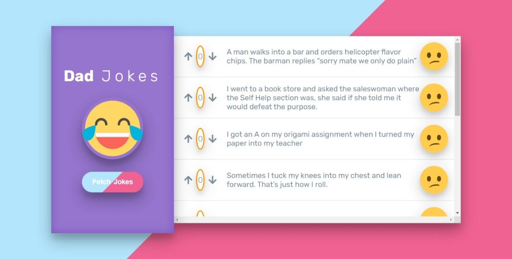

# DAD JOKES CHALLENGE

 Build an app that lets people view and vote on cheesy jokes.When the page loads, it should fetch 10 jokes.Your application should list the jokes, along with a “vote-up” button, a “vote-down” button, and the net score for each joke. Users can vote, and the net score should update. 

              
